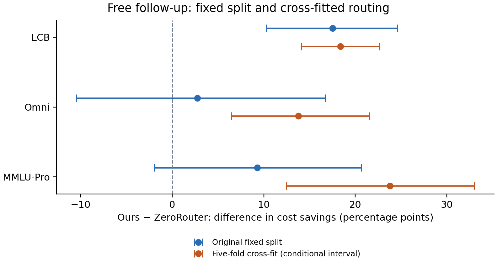

# Free ZeroRouter follow-up results

All four approved analyses completed locally without new generations or API spending. Protocol: [ZR_POWER_PROTOCOL.md](../ZR_POWER_PROTOCOL.md). These are exploratory analyses of already observed data.

## Routing comparison

Effects are percentage-point differences in savings versus median-output routing. The original utility sweep and metric are preserved.

| Dataset | Fixed split, effect [95% CI] | Cross-fit, effect [conditional 95% interval] |
| --- | --- | --- |
| LCB | +17.5 [+10.3, +24.6] | +18.4 [+14.1, +22.6] |
| Omni | +2.8 [-10.4, +16.7] | +13.8 [+6.5, +21.6] |
| MMLU-Pro | +9.3 [-2.0, +20.6] | +23.8 [+12.5, +33.0] |

**Interpretation:** LCB remains the only clear win in the original fixed-split analysis. Cross-fitting favors our method on all three pools, but its intervals condition on fitted heads and omit uncertainty from overlapping training folds. Larger training sets and randomized splits change the setting; these intervals do not establish three independent confirmatory wins. Keep the original comparison primary.

One accuracy band shared by all three arms gives similar conclusions; see `summary.json`. Fixed point effects differ slightly from the previously reported bootstrap means. All original per-arm savings reconstruct to within 7e-14 percentage points.

## Generation uncertainty diagnostic

| Dataset | Problem-only SD (pp) | Generation-only SD (pp) | Nested SD (pp) |
| --- | --- | --- | --- |
| LCB | 3.72 | 1.72 | 4.23 |
| Omni | 6.82 | 3.72 | 7.19 |
| MMLU-Pro | 6.00 | 2.69 | 6.49 |

Generation noise is noticeable, but smaller than problem-resampling uncertainty in this diagnostic. These are empirical resampling distributions, not a decomposition of population variance: problem resampling already includes noise in the observed problem means. The small number of draws limits the inner bootstrap. Extra generations may help, but these results do not quantify the benefit or establish an optimal collection plan.

## Pooled evidence and equivalence

Equal-weight exploratory Stouffer test on the original fixed splits: one-sided p = 0.00194. Individual one-sided centered-bootstrap p estimates: LCB 0.000999, Omni 0.3706, MMLU-Pro 0.05694. This is pooled directional evidence, substantially helped by LCB; it does not establish superiority separately on Omni or MMLU-Pro. Bootstrap p values have finite resolution (1/1001).

Original Omni split: 90% interval [-8.1, +14.2] pp; +/-5 pp equivalence not established. Normal approximation TOST p = 0.372.
Cross-fitted Omni: 90% interval [+7.4, +20.3] pp; +/-5 pp equivalence not established. Normal approximation TOST p = 0.987.

Do not call Omni equivalent. The fixed split remains inconclusive; the cross-fitted result instead favors our method in its different evaluation setting.

## Fold variation and implementation checks

| Dataset | Individual held-out fold effects (pp) |
| --- | --- |
| LCB | +19.9, +22.7, +11.7, +12.9, +26.3 |
| Omni | +25.6, +11.4, -4.2, +1.7, +30.2 |
| MMLU-Pro | +1.8, +26.5, +43.2, +31.9, +13.1 |

Individual folds are small and their training sets overlap. Their differences are descriptive, not independent replications. Only one fold partition was run, as specified in the protocol.

The full training row-space reduction preserves the linear model geometry. A direct full-feature check on Omni fold 0 / route 0 gave max probability difference 0.000155 and max relative cost difference 3.7e-7 (solver precision); ridge selected the same penalty. All routes have at least one valid draw. For fidelity, first-draw C selection and Platt calibration retain the legacy treatment of invalid draw 0 as failure (8/6/10 cells on LCB/Omni/MMLU-Pro); all-draw likelihoods and evaluation exclude invalid draws.

Artifacts: `summary.json`, per-pool JSON and bootstrap NPZ files, held-out predictions, fold assignments/selections, `fold_effects.json`, `verification.json`, `provenance.json`, and `comparison.pdf`. Reproduce with `zr_power.py --pool <LCB|Omni|MMLU-Pro>`, then `zr_power.py --aggregate` and `zr_power_report.py`.

## Recommendation

Keep LCB as the established baseline win and describe MMLU-Pro/Omni cautiously. Cross-fitting is useful robustness evidence, suitable for supplementary material with the dependency caveat. The pooled test is not needed for the four-page paper. If a stronger separate MMLU-Pro claim is essential, prioritize additional untouched problems; generation-only uncertainty is smaller but not negligible. No paid follow-up has been launched.
