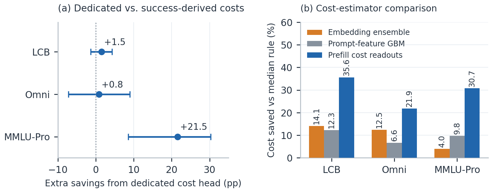

# Predicting Reasoning-Model Costs from Shared Prefill Activations

## Abstract

Reasoning-model routers must estimate generation cost before choosing a model, yet output lengths vary substantially across queries. We estimate route-specific costs from the prefill activations of a frozen 4B encoder. Linear cost readouts use the same representation as the success predictor and require no target-model computation before route selection. Holding success predictions fixed, query-dependent pricing saves 35.6% on LiveCodeBench, 21.9% on Omni-MATH-500, and 30.7% on MMLU-Pro relative to median-length pricing at matched accuracy. Adapted embedding and prompt-feature estimators have lower point estimates, although the differences on Omni are inconclusive. On MMLU-Pro, dedicated cost readouts add 21.5 percentage points over pricing derived from predicted success. On additional coding datasets, oracle costs reduce spending, but predicted costs do not produce statistically significant savings. The benefit of cost prediction therefore varies across datasets.

## Introduction

Reasoning-model routing requires predicting both correctness and generation cost before choosing a model. Token rates are known, but reasoning-trace lengths depend on the query. A model that is cheap on average may be expensive on a particular problem. Estimating query-specific output length may change the selected route.

Prefill routers estimate correctness from prompt activations. The prefill-router architecture of Varshney et al. ([Prefill router](https://arxiv.org/abs/2603.20895)) explicitly defers output-length prediction and prices outputs using median training length. We use these representations to predict output lengths for multiple reasoning models. A frozen 4B encoder processes the query, and per-route linear readouts estimate success and cost before route selection (Figure 1). Cost prediction adds readouts to an existing prefill router without another encoder pass.

We compare cost estimators while holding success predictions and the routing objective fixed. Predicted costs reduce generation spending by 22–36% relative to median-length pricing on three datasets. On MMLU-Pro, cost readouts improve routing beyond costs inferred from success predictions. On three additional coding datasets, estimated costs provide no statistically significant savings despite reductions under oracle costs.

### Related work.

Prior routers have used learned cost estimates: MixLLM predicts output length from query embeddings ([MixLLM](https://arxiv.org/abs/2502.18482)), and CARROT estimates cost and performance using embedding-based nearest neighbors or a shared fine-tuned RoBERTa encoder ([CARROT](https://arxiv.org/abs/2502.03261)). Activation-based length prediction also supports inference scheduling ([ALPS](https://doi.org/10.5281/zenodo.19078431), [Entropy-guided length prediction](https://arxiv.org/abs/2602.11812)). We instead estimate costs for multiple reasoning routes from frozen generative prefill features using linear readouts. ZeroRouter derives length from item-response difficulty bins ([ZeroRouter](https://arxiv.org/abs/2601.06220)); we compare this approach with separate cost prediction.

**Routing architecture and cost savings.** (a) A frozen encoder supplies shared features to per-route success and cost readouts before one route is selected. Each route supplies training labels, but its activations and generation are unnecessary before dispatch. (b) Holding success predictions fixed, predicted costs reduce generation spend relative to median-length pricing at matched accuracy. Whiskers show paired 95% bootstrap intervals; common encoder overhead is excluded.

## Cost Prediction and Routing

For query $x$ and route $m$, let $p_m(x)$ be the probability of correctness and $c_m(x)$ the expected generation cost. A route is a model with a fixed reasoning-effort setting. We select one route before generation:

$$
m^*(x;V)=\arg\max_m\{V\hat p_m(x)-\hat c_m(x)\},
$$

where $V$ sets the value of a correct answer. There is no verifier or fallback call.

### Features and prediction heads.

We concatenate mean-pooled and last-token activations from eight stored layers of a frozen Qwen3-4B encoder and standardize using training statistics. The Instruct-2507 encoder is used on LiveCodeBench and MMLU-Pro; Thinking-2507 is fixed for Omni. Both readouts are regularized linear models. Logistic success heads use a binomial likelihood over valid draws and held-out Platt calibration. Ridge cost heads fit squared error in log mean output length, with training-only cross-validation for regularization. The different losses match correctness outcomes and continuous lengths. Success-head penalty selection and Platt calibration use the first draw. Each cost head needs output-length labels from its target route; zero-shot transfer to unseen models is not assumed.

### Generation cost estimation.

We exponentiate predicted log length, apply training-residual smearing, and match the route's training mean. For predicted output tokens $\hat\ell_m(x)$, input tokens $n_m^{\rm in}(x)$, and input/output rates in dollars per million,

$$
\hat c_m(x)=\frac{r_m^{\rm in}n_m^{\rm in}(x)+r_m^{\rm out}\hat\ell_m(x)}{10^6}.
$$

The reference substitutes median valid training output length. The empirical oracle substitutes mean observed problem–route output length. Only the oracle uses evaluation lengths when selecting a route; every arm is charged observed tokens after its decisions are fixed.

## Experimental Protocol

The main pools contain 892 LiveCodeBench problems ([LiveCodeBench](https://arxiv.org/abs/2403.07974)), all 500 Omni-MATH-500 problems from Omni-MATH ([Omni-MATH](https://arxiv.org/abs/2410.07985)), and a subject-stratified 1,000-question MMLU-Pro subset ([MMLU-Pro](https://arxiv.org/abs/2406.01574)). Train/calibration/test counts are 441/110/341, 275/75/150, and 550/150/300. The five routes are gpt-oss-20b at low/medium effort, deepseek-v4-flash, and gpt-oss-120b at medium/high effort. Approximately 16/12/8/6/3 valid draws per route are retained on LiveCodeBench and 4/3/3/2/2 on the other pools. Correctness and cost are estimated from all valid draws; generations are not treated as independent test problems.

### Pricing and controls.

We hold the recorded market rates fixed across arms: input/output dollars per million are 0.018/0.09 for gpt-oss-20b, 0.04704/0.09408 for deepseek-v4-flash, and 0.15/0.60 for gpt-oss-120b. Reported savings isolate target generation spend. The encoder pass is common to success-only and success-plus-cost routing, so these are incremental savings for an existing prefill router. Training and calibration exclude test problems.

### Matched-accuracy evaluation.

We sweep $V$, construct test accuracy–cost frontiers, and allow randomized mixtures between convex-hull points. Let $C_{\rm arm}(a)$ denote cost at accuracy $a$. Savings against median pricing are

$$
G=1-\exp\left[\frac{1}{12}\sum_{j=1}^{12}
\log\frac{C_{\rm arm}(a_j)}{C_{\rm median}(a_j)}\right],
$$

using 12 targets over the interior 5–95% of the accuracy band shared by the estimator, median reference, and empirical oracle. Each estimator's band can differ; paired differences below compare these savings summaries. Oracle $G$ measures available headroom. We use 500 paired problem bootstrap resamples, keeping all routes and draws of a problem together. Intervals condition on fitted heads. These descriptive frontiers do not measure a deployment operating point chosen before evaluation. The separate end-to-end ZeroRouter comparison uses 1,000 resamples and its own comparison bands.

| Cost estimator | LiveCodeBench | Omni-MATH-500 | MMLU-Pro |
| --- | ---: | ---: | ---: |
| Embedding ensemble (MixLLM-style) | 14.1 [5.3, 21.0] | 12.5 [−2.4, 25.6] | 4.0 [−4.7, 14.9] |
| Prompt-feature GBM | 12.3 [0.7, 21.4] | 6.6 [−12.2, 21.2] | 9.8 [−4.5, 25.9] |
| Cost from success predictions | 34.1 [24.7, 40.9] | 21.0 [6.6, 33.7] | 9.2 [−2.2, 24.6] |
| Shared-prefill cost readouts (ours) | 35.6 [27.1, 41.9] | 21.9 [8.9, 33.5] | 30.7 [16.3, 43.2] |

**Table 1.** **Cost-estimator comparison.** Cost savings $G$ (%) against median-length pricing; brackets give 95% paired-problem bootstrap intervals for each estimator. Bands are defined per estimator as described in the protocol; these are not percentage savings directly against another learned estimator. Embedding and prompt-feature baselines are adaptations. Significance of estimator differences requires the paired contrasts reported in the text.

**Cost-prediction ablation.** (a) Added savings from dedicated cost readouts over cost inferred from success predictions, with paired 95% intervals. (b) Estimator savings with success predictions held fixed. Panels report percentage-point differences and absolute percentage savings, respectively. Bars in (b) are point estimates; Table 1 gives intervals.

## Results

### Cost-estimator comparison.

Replacing median-length estimates with predicted costs saves 35.6% on LiveCodeBench, 21.9% on Omni, and 30.7% on MMLU-Pro; all three intervals exclude zero (Table 1). These savings are approximately 78%, 49%, and 47% of the savings under empirical oracle costs (46.0%, 44.2%, and 65.1%).

The embedding baseline averages per-route MLP, random-forest, and nearest-neighbor regressors on jina-code embeddings, adapting MixLLM's predictor family. The GBM uses prompt length, numbers, examples, constraints, and keyword counts. Both fit log output length using the same training split and price conversion. On MMLU-Pro, paired advantages over these estimators are 26.7 points [12.4, 40.2] and 20.9 [3.8, 33.3]. On Omni, the differences are inconclusive: 9.4 [$-4.4$, 24.2] and 15.2 [$-1.4$, 34.1]. These adaptations do not isolate representation choice from encoder size and regression design.

### Costs inferred from success predictions.

We regress log output length on the success heads' predicted logits and their squares, keeping success predictions fixed in routing. This control saves 34.1% on LiveCodeBench and 21.0% on Omni, with inconclusive differences from dedicated cost readouts (Figure 2). On MMLU-Pro it saves 9.2%, versus 30.7% for the dedicated head: a paired advantage of 21.5 points [8.5, 30.3].

On MMLU-Pro, empirical outcome-based difficulty explains little of log length (mean $R^2\approx .19$). Adding subject labels to success-derived pricing raises savings to 22.3%, accounting for roughly 60% of the difference from the dedicated cost head. This suggests that subject variation partly explains the improvement. We do not measure whether differences in required reasoning account for the remaining variation.

### Comparison with ZeroRouter.

Our ZeroRouter reimplementation uses its item-response model and difficulty-bin pricing ([ZeroRouter](https://arxiv.org/abs/2601.06220)), with MAP instead of SVI and frozen 4B features for latent prediction. Dimension, seed, and bin count are selected on calibration. Our end-to-end advantage is 17.5 points [9.8, 24.9] on LiveCodeBench, with inconclusive differences on MMLU-Pro ($+9.3$ [$-2.6$, 21.5]) and Omni ($+2.8$ [$-10.7$, 16.6]). Holding its success predictions fixed, substituting our cost heads raises savings from 18.5 to 35.5%, 20.0 to 22.0%, and 21.6 to 32.4%, respectively. These point estimates indicate that the cost heads can also be used with ZeroRouter success predictions. The comparison uses a reimplementation on our five-route pools, which differ from ZeroRouter's original population-scale experiment.

### Results on additional datasets.

CodeContests ([AlphaCode / CodeContests](https://arxiv.org/abs/2203.07814)), TACO ([TACO](https://arxiv.org/abs/2312.14852)), and BigCodeBench ([BigCodeBench](https://arxiv.org/abs/2406.15877)) have savings under oracle costs of 21.8%, 36.1%, and 20.2%, yet learned gains of 2.0%, 2.1%, and $-3.3%$ have intervals spanning zero. RouterBench's chat pool ([RouterBench](https://arxiv.org/abs/2403.12031)) has only 10.5% headroom. These contrast pools differ in models, prices, and accuracy ladders. They show that the observed gains do not extend to every dataset. Differences among the pools prevent attributing these results to reasoning alone. Additional controls and the headroom plot appear in the supplement.

## Discussion and Limitations

The method estimates costs for several target models from one encoder, using training output-length labels for each route. Our pools cover five configurations from two model families. The adapted estimators do not reproduce complete MixLLM or CARROT routers, and CARROT's exact estimators are not evaluated. Bootstrap intervals omit training and calibration-selection uncertainty; empirical oracle lengths also have sampling error. Replay evaluates stored generations, and matched-accuracy frontiers allow mixtures chosen using evaluation outcomes. Encoder overhead is excluded from incremental generation savings. Larger held-out samples, broader model families, and calibration-selected operating points would strengthen the evidence.

## Conclusion

We estimate reasoning-model costs from the same frozen prefill features used to predict success. Linear cost readouts reduce generation spending by 22–36% relative to median-length pricing on three datasets. On MMLU-Pro, they also improve on costs inferred from success predictions. The additional coding datasets show no statistically significant benefit from predicted costs, even when oracle costs reduce spending. These results support using separate cost predictions in some routing settings, while leaving their generalization across datasets and model families unresolved.

## References

- [Prefill router](https://arxiv.org/abs/2603.20895)
- [MixLLM](https://arxiv.org/abs/2502.18482)
- [CARROT](https://arxiv.org/abs/2502.03261)
- [ZeroRouter](https://arxiv.org/abs/2601.06220)
- [LiveCodeBench](https://arxiv.org/abs/2403.07974)
- [Omni-MATH](https://arxiv.org/abs/2410.07985)
- [MMLU-Pro](https://arxiv.org/abs/2406.01574)
- [RouterBench](https://arxiv.org/abs/2403.12031)
- [AlphaCode / CodeContests](https://arxiv.org/abs/2203.07814)
- [TACO](https://arxiv.org/abs/2312.14852)
- [BigCodeBench](https://arxiv.org/abs/2406.15877)
- [Entropy-guided length prediction](https://arxiv.org/abs/2602.11812)
- [ALPS](https://doi.org/10.5281/zenodo.19078431)
