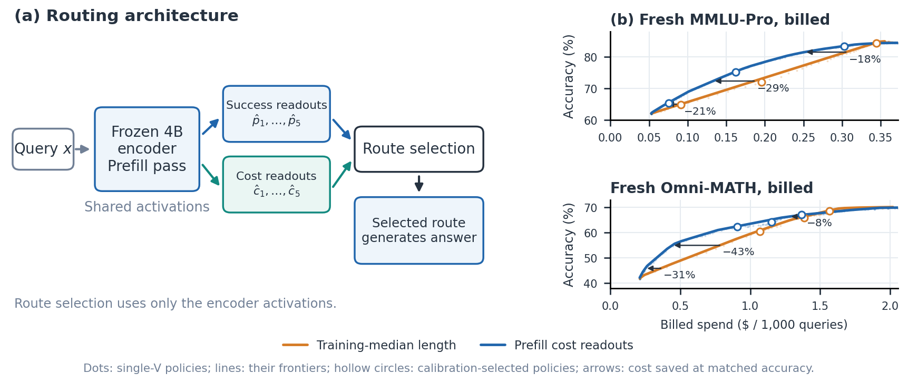

# Predicting Reasoning-Model Costs from Shared Prefill Activations

## Abstract

Routers choose a model per query by trading predicted correctness against cost, but most price each model at a constant, although a reasoning model's output length varies by an order of magnitude across queries. We predict route-specific output length from the prefill activations of a frozen 4B encoder that already supplies the success predictions, using one linear readout per route. On 6,500 new MMLU-Pro and 1,000 new Omni-MATH problems, priced at the costs actually billed, predicted costs reduce spending at matched accuracy by 23.1% and 27.8% relative to median-length pricing. They also beat every alternative estimator we evaluated, including a reimplementation of ZeroRouter, with paired intervals excluding zero; the one exception is cost read off the success predictions on Omni-MATH, where length tracks difficulty. The gain comes from the prefill representation rather than the readout: a text embedder twice the size loses by 10–18 points under every readout, while a 1.7B prefill is already within the intervals of the 4B one. Deployed models also drift: the same model served by different providers differs in output length and price. Treating each provider as the same model plus one offset removes, on average, a 37% overestimate after an unannounced provider shift, and a few calls identify which provider to pin. Pinning also makes cost more predictable: on APPS it raises our saving over median pricing from 11% to 19%.

## Introduction

Routing reasoning models requires predicting both correctness and cost before generation. Token rates are published; the number of tokens is not. A model that is cheap on average can be expensive on a particular problem, and the outputs of the models we study vary 10–90$\times$ across problems.

Prefill routers predict correctness from a small encoder's prompt activations; the prefill router of Varshney et al. ([Prefill router](https://arxiv.org/abs/2603.20895)) explicitly prices outputs at median training length. We read output length from the same activations (Figure 1). Cost prediction adds one linear readout per route to an existing prefill router, without another encoder pass.

We contribute: (i) evidence on fresh problems and billed prices that prefill cost readouts reduce spending at matched accuracy and outperform text-embedding, prompt-feature, difficulty-bin and success-derived cost estimators; (ii) a mechanism: success-derived pricing suffices where output length tracks difficulty and fails where it does not; (iii) controls showing the gain is the prefill representation, holds from a 1.7B prefill upward and transfers to two further model families; (iv) a deployment finding: the same model's endpoints drift, and the shared readouts absorb this with one offset per endpoint.

### Related work.

MixLLM predicts output length from query embeddings ([MixLLM](https://arxiv.org/abs/2502.18482)); CARROT estimates cost with embedding nearest neighbours or a fine-tuned RoBERTa ([CARROT](https://arxiv.org/abs/2502.03261)); ZeroRouter prices queries by item-response difficulty bins ([ZeroRouter](https://arxiv.org/abs/2601.06220)). Activation-based length prediction also supports scheduling ([ALPS](https://doi.org/10.5281/zenodo.19078431), [Entropy-guided length prediction](https://arxiv.org/abs/2602.11812)). Hosted open-weight models vary across providers in accuracy, length and price ([Same model, not the same service](https://arxiv.org/abs/2605.02821), [API gateway consistency](https://arxiv.org/abs/2604.21083), [Model equality testing](https://arxiv.org/abs/2410.20247)); FACET routes among providers of a fixed model per (provider, task) using measured outcomes ([Market-aware provider routing (FACET)](https://arxiv.org/abs/2609.37902)). We instead route per query over endpoints of several models with predicted, endpoint-specific costs.

**Shared prefill readouts and fresh routing curves.** (a) One frozen encoder supplies per-route success and cost readouts. (b) Fresh accuracy versus billed spending for the deterministic policies of the $V$ grid (dots) and their frontiers (lines); hollow circles mark the policies selected on original calibration for the targets of Table 2. Arrows run from the median rule's frontier to ours at matched accuracy and give the cost saved; averaged over the shared accuracy band the saving is 23% on MMLU-Pro and 28% on Omni-MATH. Both arms use the same encoder pass.

## Cost Prediction and Routing

For query $x$ and route $m$ (a model at a fixed reasoning effort, served by an endpoint), let $p_m(x)$ be the probability of a correct answer and $c_m(x)$ the expected generation cost. One route is chosen before generation,

$$
m^*(x;V)=\arg\max_m\{V\hat p_m(x)-\hat c_m(x)\},
$$

where $V$ is the value of a correct answer; sweeping $V$ trades accuracy for cost. Every query is answered once, with no verifier or fallback.

### Readouts.

We concatenate mean and last-token activations from eight layers of a frozen Qwen3-4B (Instruct-2507; Thinking-2507 on Omni), standardized on training data. Success readouts are L2-regularized logistic regressions with held-out Platt calibration; cost readouts are ridge regressions of log mean output length, regularized by training-only cross-validation. Predicted length is exponentiated with residual smearing and matched to the route's training mean, then priced: $\hat c_m(x)=r_m^{\rm in}n^{\rm in}_m(x)+r_m^{\rm out}\hat\ell_m(x)$.

### Endpoint offsets.

An endpoint of an already-modelled route (a new provider, or a provider whose behaviour changed) reuses the route's readouts with one multiplicative length offset, the ratio of observed to predicted mean output over $k$ labelled calls, and its own price.

## Experimental Protocol

The routes are gpt-oss-20b at low and medium effort, deepseek-v4-flash, and gpt-oss-120b at medium and high effort, called through OpenRouter. Original pools: 892 LiveCodeBench ([LiveCodeBench](https://arxiv.org/abs/2403.07974)), 500 Omni-MATH-500 ([Omni-MATH](https://arxiv.org/abs/2410.07985)) and 1,000 subject-stratified MMLU-Pro ([MMLU-Pro](https://arxiv.org/abs/2406.01574)) problems with 2–16 draws per route; train/calibration/test splits are 441/110/341, 275/75/150 and 550/150/300. Fresh sets: 6,500 MMLU-Pro and 1,000 Omni-MATH problems disjoint from the original pools (one draw per route), collected after all readouts were fitted.

### Prices.

Realized cost is the cost billed for each call. Predictions are priced at each model's effective billed rate, fitted on the fresh calls (USD per million output tokens: 0.13 for gpt-oss-20b, 0.12 for deepseek-v4-flash, 0.26 for gpt-oss-120b). These differ from the list prices by up to 2.3$\times$. Rates cross-fitted on the other half of the fresh problems move by at most 1.5% and change every comparison below by at most 0.6 points, so fitting rates on the evaluation calls does not favour any estimator.

### Evaluation.

All estimators are fitted on original training problems only and evaluated on the fresh problems with the same success predictions. Each $V$ on a dense grid gives a deterministic policy and an observed (cost, accuracy) point. Comparing two cost estimators $a,b$, we interpolate each one's cost at 12 accuracies spanning the interior 90% of the range both reach and report $1-\exp(\overline{\log C_a/C_b})$, the cost saved by $a$ at matched accuracy. Intervals are percentile intervals from paired problem bootstraps (300 resamples), keeping each problem's routes together. Separately, deployable policies select the cheapest $V$ reaching each accuracy target on original calibration and are applied once to the fresh problems.

| Cost saved by ours vs. | Omni-MATH ($n$=1,000) | MMLU-Pro ($n$=6,500) |
| --- | ---: | ---: |
| Training-median length | 27.8 [20.3, 33.1] | 23.1 [18.1, 26.8] |
| Training-mean length | 28.2 [22.4, 33.6] | 20.5 [16.7, 23.6] |
| Prompt-feature GBM | 20.3 [11.8, 26.5] | 18.4 [12.2, 21.7] |
| ZeroRouter (reimplemented) | 18.0 [9.0, 24.7] | 19.3 [15.5, 22.6] |
| Difficulty bins | 11.6 [5.2, 16.2] | 12.7 [7.8, 16.1] |
| Cost from success predictions | 3.2 [−1.7, 7.7] | 14.1 [11.4, 16.6] |

**Table 1.** **Fresh problems, billed costs.** Cost saved (%) by prefill cost readouts relative to each estimator at matched accuracy, with 95% paired bootstrap intervals. ZeroRouter: item-response latent fitted on the five routes, 4B features, its own success model and bin pricing, configuration chosen on calibration. Difficulty bins: ten quantile bins of mean predicted success logit.

| Fresh set | Target | Savings, % | $Δ$ acc., pp | Matched acc., % |
| --- | ---: | ---: | ---: | ---: |
| MMLU-Pro | 0.65 | 17.2 [9.8, 23.9] | $+0.51$ [$-0.15$, $+1.18$] | 21.2 [11.7, 26.6] |
|  | 0.75 | 17.1 [10.2, 23.6] | $+3.18$ [$+2.11$, $+4.19$] | 27.4 [19.5, 32.2] |
|  | 0.85 | 12.1 [9.0, 15.4] | $-1.11$ [$-1.49$, $-0.69$] | 7.7 [3.8, 10.9] |
| Omni-MATH | 0.65 | 15.3 [7.1, 22.9] | $+1.80$ [$-0.10$, $+3.70$] | 20.9 [10.1, 28.0] |
|  | 0.70 | 16.8 [12.3, 21.4] | $-1.70$ [$-3.20$, $-0.20$] | 7.5 [−3.1, 13.0] |
|  | 0.75 | 12.7 [8.4, 17.2] | $-1.60$ [$-2.80$, $-0.40$] | 4.8 [−3.8, 9.0] |

**Table 2.** **Deployable policies.** Policies chosen on original calibration for each accuracy target and applied once to fresh problems; learned versus median-length pricing, billed costs. Savings and $Δ$ accuracy compare the two selected policies (paired bootstrap, 2,000); matched accuracy compares our policy with the median-pricing frontier at our achieved fresh accuracy (300 resamples). Fresh accuracy need not equal the target.

## Results

### Fresh problems.

At matched accuracy, prefill cost readouts spend 23.1% less than median-length pricing on MMLU-Pro and 27.8% less on Omni-MATH (Table 1). They also spend 18–20% less than a full ZeroRouter reimplementation and 18–20% less than a prompt-feature model. Calibration-selected policies save 12–29% at every target, but each lands at its own fresh accuracy, $-1.7$ to $+3.2$ points from the median policy (Table 2). Evaluated at our achieved accuracy, savings are 21–27% in the middle of the range and 5–8% near the top, where every method calls the strongest routes. Calibration selection itself costs little: our selected policies spend 0–2% more than our own fresh curve at the same accuracy, with one exception at 8%. The intervals in Table 1 hold the fitted readouts fixed. Resampling the training problems as well and refitting every estimator widens them: all MMLU-Pro comparisons and the Omni-MATH comparison with median pricing ([14.6, 30.6]) remain positive, but the Omni-MATH comparison with difficulty bins does not ([$-3.4$, 13.2]).

### When success predictions suffice.

Reading cost off the success predictions (a ridge regression of log length on success logits) ties the dedicated readout on Omni-MATH but loses 14.1 points on MMLU-Pro. On Omni-MATH, output length tracks difficulty. On MMLU-Pro, even empirical difficulty explains little of log length ($R^2\approx .19$), while subject labels recover roughly 60% of the gap. The prefill encodes length information beyond difficulty, and that information pays where difficulty and length come apart.

### Representation, readout and prefill size.

Table 3 crosses three text encoders with three cost readouts: ridge, CARROT-style $k$-nearest neighbours and a MixLLM-style ensemble, each with our success predictions and with every encoder pass priced. Our readout saves 10–24% against every cell, including Qwen3-Embedding-8B, an encoder twice the prefill's size. On PCA-reduced 4B features the three readouts are within about 3 points of one another, so the gain comes from the representation rather than the regressor. Pricing the encoder pass changes no comparison by more than 3 points. Table 4 varies the prefill model while keeping prompts, layers and both readouts fixed. Every size saves 18–28% against median pricing; length $R^2$ rises with size, but routing gains saturate by 1.7B, which is within the intervals of our 4B router. The 0.6B prefill loses 5–8 points and 8B adds nothing.
The result is not specific to Qwen: prefills from three other families (Phi-4-mini, Granite-3.3-2B, SmolLM2-1.7B) also save 20–28% against median pricing on both sets. Matching our router depends on the pool: Phi-4-mini is 3.2 points ahead on MMLU-Pro but 9 behind on Omni-MATH, and SmolLM2-1.7B is within the intervals on Omni-MATH but 3.8 behind on MMLU-Pro.

### New model families.

Readouts for Qwen3-32B and GLM-4.7-flash, fitted on the same frozen 4B features, were evaluated on 1,905 fresh MMLU-Pro problems (fresh log-length $R^2$ .48 and .06). With all seven routes, prefill cost readouts save 22.6% [15.0, 28.9] relative to median pricing, 8.5% [3.4, 13.3] relative to cost from success and 7.4% [0.1, 13.5] relative to difficulty bins. On a pool of the two gpt-oss-20b routes and the two new families, they save 32.5%, 11.9% and 15.1%. Readouts onboarded from ten examples per new route stay within 2.3 points of the full readouts in the seven-route pool.

|  | Omni-MATH |  |  | MMLU-Pro |  |  |
| --- | ---: | ---: | ---: | ---: | ---: | ---: |
| Encoder | Ridge | $k$NN | MixLLM | Ridge | $k$NN | MixLLM |
| Qwen3-Embedding-8B | 13.4 | 18.1 | 17.6 | 12.4 | 13.2 | 14.8 |
| jina-embeddings 137M | 20.8 | 23.8 | 22.6 | 13.1 | 16.0 | 11.1 |
| MiniLM-L12 | 17.7 | 21.9 | 20.3 | 11.2 | 12.8 | 10.2 |

**Table 3.** **Representation and readout.** Cost saved (%) by our prefill readouts relative to each encoder–readout cell at matched accuracy; fresh problems, billed costs, every encoder pass priced, same success predictions. Every paired bootstrap interval (200 resamples) excludes zero.

|  | Omni-MATH |  |  | MMLU-Pro |  |  |
| --- | ---: | ---: | ---: | ---: | ---: | ---: |
| Prefill | $R^2$ | vs. median | vs. ours | $R^2$ | vs. median | vs. ours |
| Qwen3-0.6B | .60 | 24.6 | $-5.1$ | .23 | 18.0 | $-7.5$ |
| Qwen3-1.7B | .64 | 27.4 | $-3.4$ | .33 | 23.5 | $+0.5$ |
| Qwen3-4B (hybrid) | .66 | 24.7 | $-1.7$ | .36 | 22.2 | $-3.3$ |
| Qwen3-8B | .67 | 24.1 | $+0.3$ | .37 | 20.8 | $-2.2$ |
| Phi-4-mini (3.8B) | .64 | 23.7 | $-9.2$ | .36 | 25.3 | $+3.2$ |
| Granite-3.3 (2.5B) | .61 | 21.3 | $-9.2$ | .29 | 22.1 | $-2.1$ |
| SmolLM2 (1.7B) | .58 | 28.4 | $-2.9$ | .23 | 20.5 | $-3.8$ |
| Qwen3-4B-2507 (ours) | .69 | 27.8 | – | .39 | 23.1 | – |

**Table 4.** **Prefill size.** Each prefill feeds both readouts, refitted with the paper's recipes on original training problems; fresh problems, billed costs. $R^2$: fresh log-length $R^2$ averaged over routes. vs. median: cost saved relative to median pricing with the same row's success predictions. vs. ours: cost saved by the row's router relative to ours (negative: it spends more); its paired intervals (300 resamples) include zero for Qwen3-1.7B and 8B on both sets, SmolLM2 on Omni-MATH and Granite on MMLU-Pro.

### Endpoints and provider variability.

On the fresh collection, the readouts overestimated deepseek-v4-flash's cost by 37% (MMLU-Pro) and 23% (Omni-MATH); all other routes were within 8%. The aggregator had moved most of these calls to a provider absent from the original data, which writes about half as many tokens at equal accuracy. One length offset from 50 fresh calls removes the bias on average (predicted/realized 0.97 and 1.00 over 200 draws of the calls), but a single fit is noisy where lengths are heavy-tailed: 95% of fits land in [0.53, 1.51] on MMLU-Pro and [0.78, 1.25] on Omni-MATH. Pinning deepseek-v4-flash to each of three providers on 1,995 fresh MMLU-Pro and 957 APPS problems shows that an endpoint is close to its model plus an offset: providers agree on correctness for 90–96% of problems (73–78% if independent) and their output lengths correlate at .83–.95. The offsets mainly decide which provider to pin. Pinning the provider that is cheapest on the fitting problems spends 4.6% [0.4, 10.3] less than routing over all three on APPS and 3.9% [1.5, 6.7] less on MMLU-Pro, and 50 calls per provider pick that provider 79% (MMLU-Pro) and over 99% (APPS) of the time, at an expected 2.1% and 0.05% extra cost.

Provider mixing also hides predictable cost. Refitting every readout on APPS with deepseek-v4-flash pinned instead of mixed raises its length $R^2$ from .08 to .64 and the oracle headroom from 2% to 30%, and our saving over median pricing from 11.1% [1.0, 20.5] to 19.4% [7.0, 27.7]; on MMLU-Pro, pinning the test calls alone raises it from 26.1% to 32.2% at equal prices (23.6% at the pinned provider's lower price, which makes that route dominant more often). 

### Live run.

On 1,000 MMLU-Pro problems never used before, the frozen router called only its chosen routes. Token predictions held (predicted/realized 0.94–1.04 per route). At the calibration-chosen targets, realized tokens priced at the rates the router used cost 45%, 46% and 10% less than under median pricing (targets .65/.75/.85), at 1.4–2.1 points lower accuracy, so these are not matched-accuracy savings. Unpinned, deepseek-v4-flash calls were billed up to 14$\times$ the rate seen in the fresh collection; re-issued pinned, the billed savings are 25%, 19% and 4%, with the policies still chosen at the old price.

### Original pools and contrasts.

Repriced at the same billed rates, savings against median pricing on the original test sets are 26.7% [21.3, 32.4] on LiveCodeBench, 25.2% [10.0, 36.4] on Omni-MATH and 35.3% [22.6, 45.2] on MMLU-Pro. LiveCodeBench falls from 35.6% at list prices because billed rates compress the gpt-oss-120b to gpt-oss-20b output-price ratio from 6.7$\times$ to 1.9$\times$. On CodeContests ([AlphaCode / CodeContests](https://arxiv.org/abs/2203.07814)), TACO ([TACO](https://arxiv.org/abs/2312.14852)), BigCodeBench ([BigCodeBench](https://arxiv.org/abs/2406.15877)) and APPS, oracle costs would save 20–36% at list prices, but predicted costs gain $-3$ to 14%, with intervals including zero.
On AIME 1983–2024 (933 problems), our pre-registered screen predicted no gain from a single draw of the cheapest route (probe $R^2$ .13). Predicted costs instead save 13.6% [7.8, 19.3] at list prices (11.3% billed; headroom 34%): with averaged draws the probe reads length at $R^2$ .39–.52, so the cheap one-draw screen understated predictability and the call failed. 
RouterBench ([RouterBench](https://arxiv.org/abs/2403.12031)) has 10.5% headroom. A fine-tuned Intern-Decision-4B success predictor, combined with our cost readouts, saves a further 11.2% [5.5, 17.1] on fresh Omni-MATH: improved success and cost predictors combine.

## Discussion and Limitations

Each route needs output-length labels, and an endpoint offset needs a few labelled calls; a single 50-call offset is noisy where lengths are heavy-tailed. The original pools use five routes from two model families; two further families (Qwen3-32B, GLM-4.7-flash) were tested on MMLU-Pro only. Fresh sets have one draw per route, and APPS is the only coding pool with pinned providers. 
Intervals are pointwise and assume independent problems; Table 1 conditions on the fitted readouts, and with training noise included the Omni-MATH comparison with difficulty bins is not significant. The prefill comparison covers four model families at up to 8B.
Billed rates were measured over one collection, and prices change within days. The ZeroRouter, MixLLM and CARROT baselines are reimplementations. The original-pool pipeline was corrected after outcomes were observed.

## Conclusion

A frozen prefill that already predicts success also predicts cost. On fresh problems at billed prices, its cost readouts reduce spending at matched accuracy and outperform the alternative estimators we tested, most clearly where output length is not just difficulty. Because endpoints of one model share these readouts up to an offset, a few dozen calls remove the bias that provider drift introduces, on average, and price a provider before it is pinned.

## References

- [Prefill router](https://arxiv.org/abs/2603.20895)
- [MixLLM](https://arxiv.org/abs/2502.18482)
- [CARROT](https://arxiv.org/abs/2502.03261)
- [ZeroRouter](https://arxiv.org/abs/2601.06220)
- [LiveCodeBench](https://arxiv.org/abs/2403.07974)
- [Omni-MATH](https://arxiv.org/abs/2410.07985)
- [MMLU-Pro](https://arxiv.org/abs/2406.01574)
- [RouterBench](https://arxiv.org/abs/2403.12031)
- [AlphaCode / CodeContests](https://arxiv.org/abs/2203.07814)
- [TACO](https://arxiv.org/abs/2312.14852)
- [BigCodeBench](https://arxiv.org/abs/2406.15877)
- [Entropy-guided length prediction](https://arxiv.org/abs/2602.11812)
- [ALPS](https://doi.org/10.5281/zenodo.19078431)
- [Same model, not the same service](https://arxiv.org/abs/2605.02821)
- [API gateway consistency](https://arxiv.org/abs/2604.21083)
- [Model equality testing](https://arxiv.org/abs/2410.20247)
- [Market-aware provider routing (FACET)](https://arxiv.org/abs/2609.37902)
